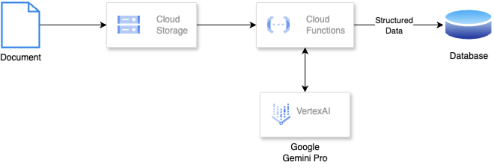
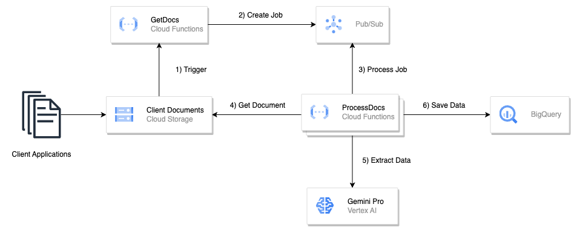

# Generative-AI-Integration-Patterns-1E

A comprehensive guide and implementation of Generative AI applicaiton integration patterns that utilize Large Language Models (LLMs) to solve various types of use cases.

For comprehensive details on the architectural patterns mentioned below, please refer to the accompanying book [Book link](). 


## Table of Contents

- [Introduction](#introduction)
- [Integration Patterns](#integration-patterns)
  - [Batch - Metadata Extraction](#batch-metadata)
  - [Batch - Summarization](#batch-summarization)
  - [Real Time - Intent Classification](#real-time-intent)
  - [Real Time -  Q&A using RAG](#real-time-RAG)
- [Getting Started](#getting-started)
- [License](#license)

## Introduction 📘

This repository delves into the integration of Large Language Models (LLMs) with various data processing tasks. It showcases different integration patterns, ranging from batch operations like metadata extraction and summarization to real-time applications such as intent classification and question-answering using retrieval-augmented generation (RAG). By leveraging the power of LLMs, this repository aims to explore innovative solutions for enhancing data processing pipelines. Whether you're interested in batch processing or real-time applications, this repository provides a comprehensive guide to integrating LLMs into your workflows.

## Integration Patterns 🏗️

### Batch - Metadata Extraciton
Utilizing LLMs to create a structured format to extract entities, and subsequently analyze 10k documents.

<div align="center">

</div>

<div align="center">
  Click on image to enlarge
</div>

### Batch - Summarization
Utilizing LLMs for summarizing client applications in the financial services industry.

<div align="center">

</div>

<div align="center">
  Click on image to enlarge
</div>

### Real Time - Intent Classification

### Real Time -  Q&A using RAG

## Getting Started 🚀

1. **Clone the Repository**:

   ```bash
   git clone https://github.com/your_username/Generative-AI-Integration-Patterns-1E.git
   ```

2. Navigate to the directory:

   ```bash
   cd Generative-AI-Integration-Patterns-1E
   ```

3. **Set up a virtual environment**:

   ```bash
   python3 -m venv .venv
   source .venv/bin/activate
   ```

4. **Install dependencies**:

   ```bash
   pip install -r requirements.txt
   ```

Follow the individual pattern READMEs for detailed setup and usage instructions.

## Challenges and Limitations ⚠️

This section discusses the potential pitfalls, challenges, and areas for improvement